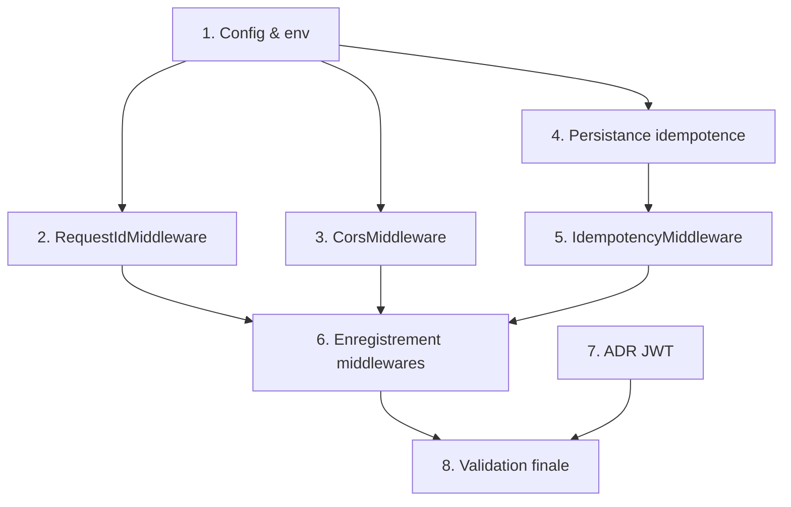

# Implementation Plan

## Overview

Plan d'implémentation de la fonctionnalité `secure-integration-idempotency` sur le backend Laravel `backend7tech`. Il couvre la configuration, trois middlewares HTTP (corrélation `X-Request-ID`, CORS par liste blanche, idempotence des créations de signalement), la persistance des clés d'idempotence, l'enregistrement des middlewares, l'ADR sur le transport du JWT, et une validation finale. Chaque tâche de code est accompagnée de tests (feature PHPUnit + propriétés) et référence les exigences correspondantes.

## Tasks

- [x] 1. Configuration et variables d'environnement
- Créer `config/cors.php` (allowed_origins parsées depuis `CORS_ALLOWED_ORIGINS`, allowed_methods, allowed_headers incluant `X-Request-ID` et `X-Idempotency-Key`, supports_credentials)
- Créer `config/idempotency.php` exposant `ttl` (défaut 86400) depuis `IDEMPOTENCY_TTL`
- Ajouter `CORS_ALLOWED_ORIGINS`, `CORS_SUPPORTS_CREDENTIALS`, `IDEMPOTENCY_TTL` à `.env.example`
- _Requirements: 1.1, 1.2, 3.5, 4.8_

- [x] 2. Middleware de corrélation X-Request-ID
- [x] 2.1 Implémenter `RequestIdMiddleware`
  - Créer `app/Http/Middleware/RequestIdMiddleware.php`
  - Lire/`trim` l'en-tête `X-Request-ID` (première occurrence), valider via `^[A-Za-z0-9_-]{1,128}$`
  - Réutiliser si valide, sinon générer un UUID v4 ; injecter dans `Log::withContext` et sur l'en-tête de réponse
  - _Requirements: 2.1, 2.2, 2.3, 2.4, 2.5, 2.6_
- [x] 2.2 Tests du RequestIdMiddleware
  - Créer `tests/Feature/RequestIdMiddlewareTest.php` (valeur valide réutilisée, absente/vide → UUID, trop longue/caractères interdits → UUID, en-tête présent en réponse, contexte de log enrichi)
  - _Requirements: 2.1, 2.2, 2.3, 2.5, 2.6_
- [x] 2.3 Test basé sur propriété — résolution du Request-ID
  - Vérifier la Property 5 : toute entrée produit soit la valeur d'entrée valide, soit un UUID v4 valide (aucun troisième cas)
  - _Requirements: 2.1, 2.2, 2.3_

- [x] 3. Middleware CORS
- [x] 3.1 Implémenter `CorsMiddleware`
  - Créer `app/Http/Middleware/CorsMiddleware.php`
  - Correspondance exacte d'origine (sensible à la casse), fail-safe si liste vide, gestion des préflights `OPTIONS` (204), en-têtes `Allow-Methods`/`Allow-Headers`, `Allow-Credentials` conditionnel
  - _Requirements: 1.1, 1.2, 1.3, 1.4, 1.5, 1.6, 1.7, 1.8_
- [x] 3.2 Tests du CorsMiddleware
  - Créer `tests/Feature/CorsMiddlewareTest.php` (origine autorisée/non, config vide, préflight autorisé/non, présence de `X-Request-ID`/`X-Idempotency-Key` dans Allow-Headers, credentials)
  - _Requirements: 1.2, 1.3, 1.4, 1.5, 1.6, 1.7, 1.8_
- [x] 3.3 Tests basés sur propriétés — CORS
  - Vérifier Property 7 (fail-safe) et Property 8 (correspondance exacte d'origine)
  - _Requirements: 1.2, 1.3, 1.4_

- [x] 4. Persistance de l'idempotence (données)
- [x] 4.1 Migration `idempotency_keys`
  - Créer la migration (colonnes `key` unique 128, `request_fingerprint`, `status`, `response_status`, `response_body`, `report_id` nullable, timestamps, index `created_at`)
  - _Requirements: 3.1, 3.2, 3.4_
- [x] 4.2 Modèle `IdempotencyKey`
  - Créer `app/Models/IdempotencyKey.php` (fillable, constante TTL, méthode `isExpired()` basée sur `config('idempotency.ttl')`)
  - _Requirements: 3.4, 3.5, 4.8_

- [x] 5. Middleware d'idempotence
- [x] 5.1 Implémenter `IdempotencyMiddleware`
  - Créer `app/Http/Middleware/IdempotencyMiddleware.php`
  - Valider la clé (1..128 → sinon 422), calculer l'empreinte SHA-256 du corps
  - Transaction + `lockForUpdate` : rejeu si `completed`+empreinte identique, 422 si empreinte différente, 409 si `processing`, sinon créer puis exécuter `$next` et enregistrer la réponse ; purge si expirée ; suppression si réponse d'erreur
  - _Requirements: 3.2, 3.3, 3.6, 3.7, 4.1, 4.2, 4.3, 4.4, 4.5, 4.6, 4.7, 4.8_
- [x] 5.2 Tests d'idempotence
  - Créer `tests/Feature/IdempotencyTest.php` (clé absente/invalide → 422, première requête → 201 + enregistrement, rejeu même corps → même réponse + 1 seul Report, corps différent → 422, clé expirée → nouvelle, `processing` → 409)
  - _Requirements: 3.2, 3.3, 3.6, 3.7, 4.1, 4.2, 4.5, 4.6, 4.7, 4.8_
- [x] 5.3 Tests basés sur propriétés — idempotence
  - Vérifier Property 1 (unicité), Property 2 (déterminisme du rejeu), Property 3 (validation de clé), Property 4 (conflit), Property 9 (expiration)
  - _Requirements: 3.3, 3.5, 4.1, 4.2, 4.3, 4.4, 4.5, 4.6, 4.8_

- [x] 6. Enregistrement des middlewares
- Enregistrer `RequestIdMiddleware` et `CorsMiddleware` sur le groupe `api` dans `bootstrap/app.php` (ordre : request-id → cors)
- Enregistrer l'alias `idempotency` et l'appliquer à `POST /api/reports` dans `routes/api.php`
- Vérifier la non-régression des endpoints existants via la suite de tests
- _Requirements: 1.3, 2.5, 3.6, 4.1_

- [x] 7. ADR — transport du JWT
- Créer `docs/adr/0001-jwt-cookie-transport.md` (contexte + limite du transport actuel, option cookie `HttpOnly`/`Secure`/`SameSite=Strict`, clause `Secure` si `None`, conséquences CORS, avantages/inconvénients des deux options, décision + justification + statut)
- _Requirements: 5.1, 5.2, 5.3, 5.4, 5.5, 5.6, 5.7_

- [x] 8. Validation finale
- Exécuter `php artisan test` et `./vendor/bin/pint` ; corriger les échecs éventuels
- _Requirements: 1.1, 2.1, 3.1, 4.1, 5.1_

## Task Dependency Graph



```json
{
  "waves": [
    {
      "wave": 1,
      "tasks": ["1", "7"],
      "description": "Configuration/env et ADR — indépendants, exécutables en parallèle."
    },
    {
      "wave": 2,
      "tasks": ["2", "3", "4"],
      "description": "Middlewares Request-ID, CORS et persistance idempotence — parallélisables après la config."
    },
    {
      "wave": 3,
      "tasks": ["5"],
      "description": "Middleware d'idempotence — dépend de la persistance (tâche 4)."
    },
    {
      "wave": 4,
      "tasks": ["6"],
      "description": "Enregistrement des middlewares — dépend des tâches 2, 3 et 5."
    },
    {
      "wave": 5,
      "tasks": ["8"],
      "description": "Validation finale — dépend de l'enregistrement (6) et de l'ADR (7)."
    }
  ]
}
```

## Notes

- Stack : Laravel 13 / PHP 8.3 / JWT `tymon/jwt-auth`. Tests via PHPUnit (`php artisan test`), formatage via Pint.
- Les tâches 2, 3 et 4 sont indépendantes une fois la tâche 1 terminée (parallélisables). La tâche 7 (ADR) est purement documentaire et indépendante du code.
- Sécurité par défaut : aucune origine CORS autorisée sans configuration explicite ; jamais de joker `*` avec credentials.
- Aucun secret n'est commité ; les valeurs sensibles passent par `.env`, documentées dans `.env.example`.
